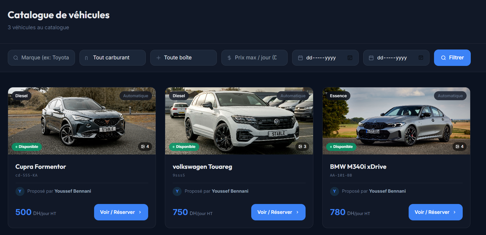
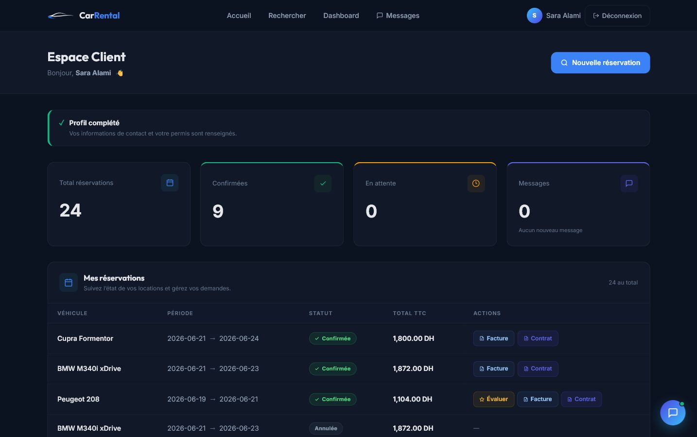
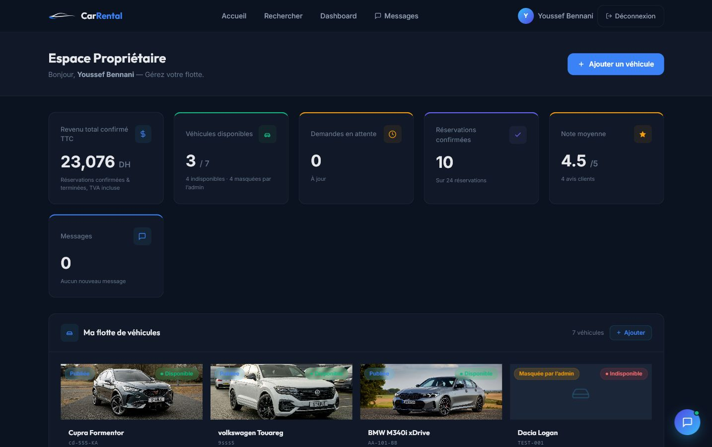
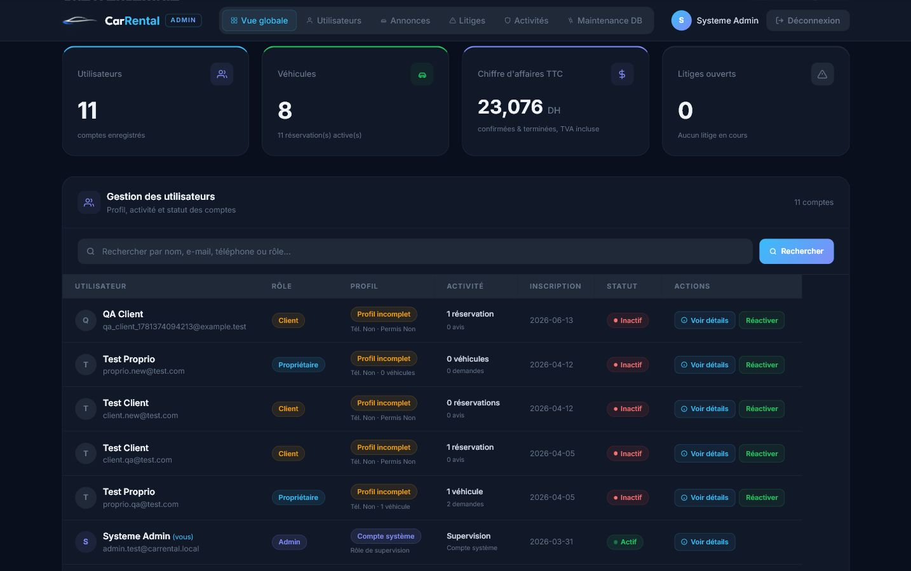

# CarRental

CarRental est une plateforme web de location de voitures entre particuliers. Elle permet aux clients de rechercher et de réserver des véhicules, aux propriétaires de gérer leurs voitures et leurs réservations, et aux administrateurs de superviser la plateforme.

## Site web

[Visiter CarRental](https://carrental-maroc.xo.je)

## Fonctionnalités principales

- Recherche de véhicules avec filtres
- Consultation des détails et des disponibilités
- Gestion des réservations
- Tableau de bord client
- Tableau de bord propriétaire
- Tableau de bord administrateur
- Paiement en ligne simulé
- Génération de contrats et de factures
- Avis et évaluations
- Chatbot intégré

## Captures d’écran

### Page d’accueil

### Catalogue et recherche de véhicules

### Tableau de bord client

### Tableau de bord propriétaire

### Tableau de bord administrateur

## Technologies utilisées

- PHP
- MySQL
- HTML
- CSS
- JavaScript
- Bootstrap

## Contexte du projet

Ce projet a été réalisé dans le cadre de la troisième année en Génie Informatique à l’EMSI.

## Auteurs

- Houssam ELBHIRI
- Mohammed Yassir Filali Ansari

> Ce dépôt présente le projet et fournit un accès au site web. Le code source n’est pas inclus.
